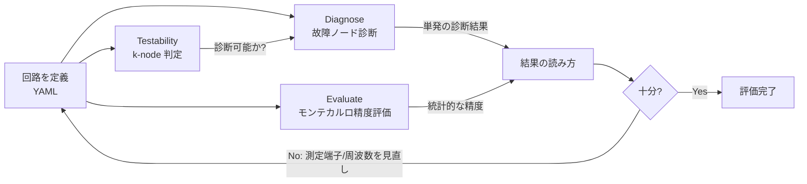
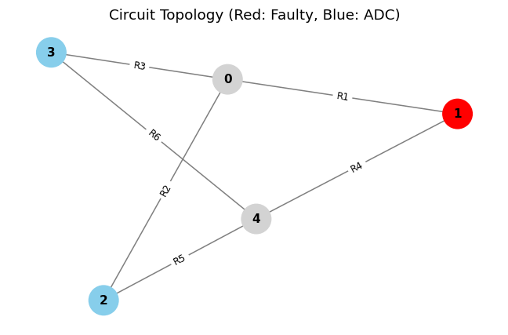
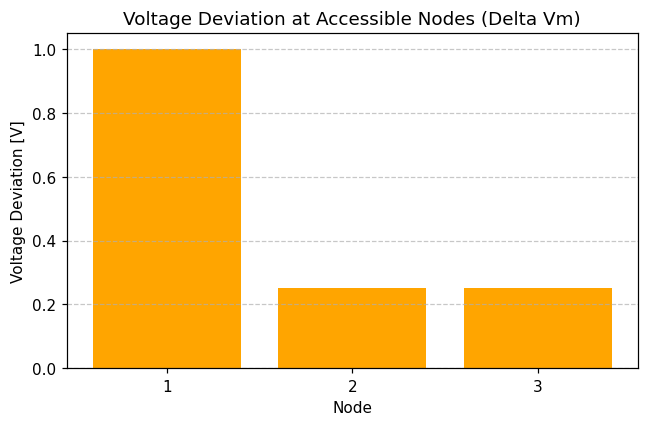
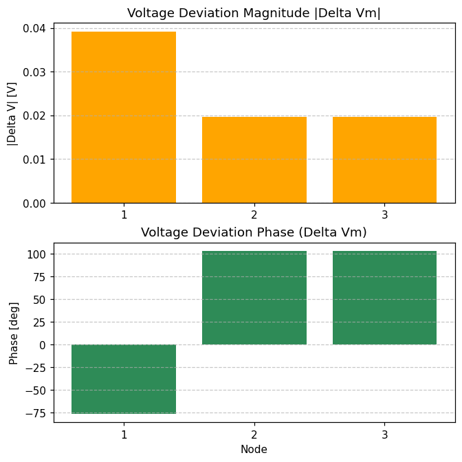
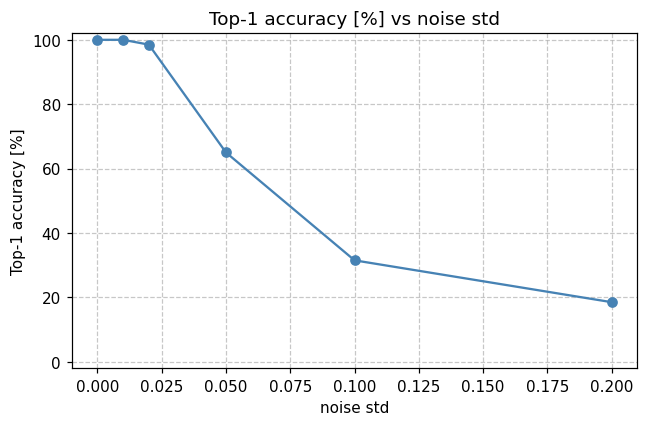

# 評価ガイド (Evaluation Guide)

本ツールで回路の**故障診断性能を評価する方法**を、CLI と GUI の両方について詳しく説明します。
「どう実行するか」だけでなく、**結果の読み方**まで含めた実務ガイドです。
（概要・理論は [README.md](README.md) を、設計の経緯は省略します。）

- 対象読者: 本ツールを使って回路の診断可能性・診断精度を確かめたい人
- 形式: コマンド例・実出力・図・表で具体的に示します

---

## 目次

1. [評価の全体像](#1-評価の全体像)
2. [準備（インストールとサンプル回路）](#2-準備インストールとサンプル回路)
3. [3 種類の評価で分かること](#3-3-種類の評価で分かること)
4. [回路の定義（YAML）](#4-回路の定義yaml)
5. [CLI での評価](#5-cli-での評価)
6. [GUI での評価](#6-gui-での評価)
7. [評価結果の読み方（リファレンス）](#7-評価結果の読み方リファレンス)
8. [典型的な評価ワークフロー](#8-典型的な評価ワークフロー)
9. [トラブルシュート / FAQ](#9-トラブルシュート--faq)
10. [図の再生成](#10-図の再生成)

---

## 1. 評価の全体像

評価は「回路を定義 → **診断可能か判定** → **故障を診断** → **精度を統計評価**」という流れで行います。
CLI でも GUI でも、内部は同じ計算ロジック（`fault/service.py`）を通るため**結果は一致**します。



| ステップ | 問い | 使うコマンド/タブ |
|:---|:---|:---|
| Testability | この測定端子配置で、最大 k 個の故障を**そもそも特定できるか**？ | `testability` / Testability タブ |
| Diagnose | 与えた故障を**正しく位置特定できるか**（1 ケース）？ | `diagnose` / Diagnose タブ |
| Evaluate | 公差・ノイズがある現実条件で**どのくらいの確率で当たるか**？ | `evaluate` / Evaluate タブ |

---

## 2. 準備（インストールとサンプル回路）

```bash
# 依存パッケージ（GUI 用 Streamlit を含む）
pip install -r requirements.txt

# パッケージとして入れる場合（CLI コマンド fault と GUI ランチャ fault-gui が使えます）
pip install -e ".[gui]"
```

同梱のサンプル回路（`examples/`）を例に使います。

| ファイル | 種別 | 特徴 |
|:---|:---|:---|
| `bridge.yaml` | DC（R のみ） | 5 ノードのブリッジ。対称回路の例 |
| `ladder.yaml` | DC（R のみ） | ラダー網 |
| `rc_bridge.yaml` | AC（R+C） | 容量を含む。複数周波数（1000/5000 Hz）で診断 |

---

## 3. 3 種類の評価で分かること

| 評価 | 入力 | 出力 | 主な用途 |
|:---|:---|:---|:---|
| **Testability** | 回路 + k | 判定（True/False）と内部ノード接続度 | 測定端子配置の設計検証（故障を入れる前の事前判定） |
| **Diagnose** | 回路 + 故障 + k (+ 周波数) | 故障ノード候補・残差・条件数・ΔV | 1 つの故障シナリオの位置特定確認・デバッグ |
| **Evaluate** | 回路 + 故障 + k + 試行数 (+公差/ノイズ) | Top-1/Top-3 精度ほか | ノイズ耐性・実用精度の統計評価 |

---

## 4. 回路の定義（YAML）

評価対象は YAML で定義します。`rc_bridge.yaml` を例にすると:

```yaml
name: rc_bridge
reference: 0                 # 基準（接地）ノード
nodes: [0, 1, 2, 3, 4]       # 全ノード
accessible: [1, 2, 3]        # 測定可能(ADC)ノード ＝ 評価で「見える」端子
frequencies: [1000.0, 5000.0]# AC 測定周波数[Hz]（C/L を含む場合は必須）
elements:
  - {name: R1, type: R, n1: 1, n2: 0, value: 1.0}     # R: value=コンダクタンス[S]
  - {name: C4, type: C, n1: 1, n2: 4, value: 1.0e-3}  # C: value=容量[F]
```

| フィールド | 意味 | 備考 |
|:---|:---|:---|
| `reference` | 接地ノード | `nodes` に含めること |
| `accessible` | 測定端子 | 基準以外に最低 1 つ必要。**多いほど診断力が上がる** |
| `frequencies` | 測定周波数[Hz] | C/L を含む回路は **1 つ以上必須**（DC では C=開放, L=短絡で評価不能） |
| `elements[].type` | `R`/`C`/`L` | `value` の単位は R=S, C=F, L=H |

> 💡 故障は「素子の `value` を変える」ことで表現します（例: `R4` のコンダクタンスを 1.0→0.3 に低下）。

---

## 5. CLI での評価

インストール済みなら `fault <サブコマンド>`、未インストールなら `python -m fault.cli <サブコマンド>` で実行します。

### 5.1 Testability（診断可能性の事前判定）

```bash
fault testability examples/bridge.yaml --k 2
```

| オプション | 既定 | 意味 |
|:---|:---|:---|
| `config`（位置引数） | — | 回路 YAML |
| `--k` | 1 | 同時に特定したい最大故障数 |

**実出力:**

```text
Config: bridge
K: 2
Testable: True
Connectivities: {4: 3}
```

**読み方:** 各内部（アクセス不可）ノードが、アクセス可能ノード／接地への**独立パスを k+1 本以上**持てば
そのノードは k 個故障下でも識別可能です。`Connectivities: {4: 3}` は内部ノード 4 の独立パスが 3 本の意味で、
`k=2` の要求 `k+1=3` を満たすので **Testable: True**。1 つでも不足すると False になります。

### 5.2 Diagnose（DC・抵抗回路）

```bash
fault diagnose examples/bridge.yaml --fault R1=0.1 --k 1
```

| オプション | 既定 | 意味 |
|:---|:---|:---|
| `--fault` | — | `Name=Value` のカンマ区切り（例 `R3=0.1,R4=0.5`）。値は故障後の素子値 |
| `--k` | 1 | 探索する最大故障ノード数 |
| `--top-n` | 5 | 表示する候補数 |
| `--method` | auto | `auto`/`exhaustive`/`omp`（[README の比較表](README.md#故障診断アルゴリズムの比較)参照） |
| `--freq` | — | 測定周波数[Hz]。省略時は YAML の `frequencies` |

**実出力:**

```text
Status: unique

Best Candidate:
  Nodes: [1]
  Residual: 6.776000e-16
  Relative Residual: 6.023111e-16
  Cond Number: 1.00

Top Candidates:
  1. Nodes: [1], Residual: 6.776000e-16
  2. Nodes: [4], Residual: 6.495191e-01
  3. Nodes: [2], Residual: 9.742786e-01
  4. Nodes: [3], Residual: 9.742786e-01
```

**読み方:**
- `Status: unique` … 候補が一意に定まった（後述の[ステータス表](#71-ステータス-status)参照）。
- `Best Candidate Nodes: [1]` … 故障ノードはノード 1（実際 `R1` はノード 1–接地間）。**正解**。
- `Residual ≈ 6.8e-16`（ほぼ 0）… 最良候補が観測 ΔV をほぼ完全に説明。2 位以降は残差が桁違いに大きく、明確に区別できている。
- `Cond Number: 1.00` … 数値的に安定（悪条件でない）。

この故障に対応するトポロジと電圧偏差は次の通りです（赤=診断された故障ノード, 青=測定端子, 灰=内部/接地）。

| トポロジ（故障位置） | 電圧偏差 ΔVm（DC） |
|:---:|:---:|
|  |  |

### 5.3 Diagnose（AC・容量/インダクタを含む回路）

C/L を含む回路は周波数を与えます（複数指定で識別力が上がります）。

```bash
fault diagnose examples/rc_bridge.yaml --fault C4=0.5e-3 --k 2 --freq 1000,5000
```

**実出力:**

```text
Frequencies (Hz): [1000.0, 5000.0]
Status: unique

Best Candidate:
  Nodes: [1, 4]
  Residual: 3.417784e-16
  Relative Residual: 5.700651e-15
  Cond Number: 66.65

Top Candidates:
  1. Nodes: [1, 4], Residual: 3.417784e-16
  2. Nodes: [1, 3], Residual: 4.288659e-02
  ...
```

**読み方:** `C4` はノード 1–4 間にあるため、故障ノードは `[1, 4]` が正解で、最良候補が一致。
AC では電圧偏差が**複素数**になるため、ΔV は**振幅と位相**の 2 段で表示されます。
複数周波数の偏差から素子の周波数依存性を解いて **R/C/L の種別**まで同定できます（GUI の「枝を再構築する」や
`reconstruct_branch_faults` を使用。`C4` は `classification = 'C'` と判定されます）。



*容量故障では位相が抵抗故障と異なる挙動を示し、これが R/C/L 種別判定の手がかりになります。*

### 5.4 Evaluate（モンテカルロ精度評価）

公差（健全素子のばらつき）と測定ノイズを与え、多数の試行で**正解率**を集計します。

```bash
fault evaluate examples/bridge.yaml --fault R4=0.3 --k 2 --trials 200 --noise 0.05 --seed 1
```

| オプション | 既定 | 意味 |
|:---|:---|:---|
| `--fault` | — | 評価する故障シナリオ |
| `--k` | 1 | 探索する最大故障ノード数 |
| `--trials` | 100 | 試行回数（多いほど精度推定が安定） |
| `--tol` | 0.0 | 健全素子の公差[%]（ガウス揺らぎ） |
| `--noise` | 0.0 | 測定ノイズ標準偏差 |
| `--seed` | 42 | 乱数シード（再現性） |
| `--freq` | — | 測定周波数[Hz] |

**実出力（JSON）:**

```json
{
  "trials": 200,
  "tol_percent": 0.0,
  "noise_std": 0.05,
  "top1_accuracy": 0.65,
  "top3_accuracy": 0.985,
  "ambiguous_rate": 0.28,
  "ill_conditioned_rate": 0.0,
  "correct_nodes": [1, 4],
  "frequencies": null
}
```

**読み方:** ノイズ `0.05` の条件で、**最良候補が正解と一致した割合（Top-1）が 65%**、
**上位 3 候補に正解が含まれる割合（Top-3）が 98.5%**。ノイズが診断を難しくしている様子が分かります。
各指標の意味は[精度指標の表](#73-精度指標evaluate)を参照。

ノイズを掃引すると、精度が劣化していく様子を可視化できます（GUI の「掃引プロット」、下図）。



*測定ノイズが大きくなるほど Top-1 精度が低下。実機の ADC 分解能・ノイズ条件で実用可否を判断できます。*

---

## 6. GUI での評価

ブラウザ上の 1 画面で、回路読込から結果・図の表示まで行えます。CLI と同じサービス層を通るため結果は一致します。

### 6.1 起動

```bash
pip install -e ".[gui]"     # 事前に GUI 依存を導入
fault-gui                   # もしくは: streamlit run fault_gui/app.py / python -m fault_gui
```

### 6.2 画面構成

```text
┌───────────────────────────┬─────────────────────────────────────────────┐
│ Sidebar                   │  [Circuit] [Testability] [Diagnose] [Evaluate]│
│                           │  ───────────────────────────────────────────  │
│ ■ 回路ソース              │                                               │
│  ○ examples から選択      │   選択中タブの内容                            │
│  ○ YAML アップロード      │   （図・表・メトリクス）                       │
│  ○ パス入力               │                                               │
│ ■ 共通パラメータ          │                                               │
│  k = [ 2 ]                │                                               │
│  frequencies = 1000,5000  │                                               │
└───────────────────────────┴─────────────────────────────────────────────┘
```

- **サイドバー**で回路（examples / アップロード / パス）と共通パラメータ（k・周波数）を設定します。
- 入力エラーは画面に**赤字で表示**され、アプリは停止しません。

### 6.3 各タブの使い方

| タブ | 操作 | 見るもの |
|:---|:---|:---|
| **Circuit** | 読込直後の確認 | トポロジ図・回路サマリ・素子一覧表 |
| **Testability** | 「判定を実行」 | Testable バッジ（緑/橙）＋内部ノード接続度の表（`ok` 列で k+1 充足を判定） |
| **Diagnose** | 故障表で素子を選び値を入力 →「診断を実行」 | Status バッジ・Best メトリクス・候補表・トポロジ図・ΔV 図、任意で R/C/L 枝再構築表 |
| **Evaluate** | 故障表 + trials/tol/noise/seed | 「単発評価」: Top-1/3 精度などのメトリクス。「掃引プロット」: tol/noise を掃引した精度曲線 |

**Diagnose タブの故障入力**は表形式（行の追加/削除が自由）で、素子は**プルダウン選択**のため名前のタイプミスが起きません。
表示される図は前掲の CLI と同じトポロジ図・ΔV 図（赤=故障/青=測定端子/灰=内部）です。

**Evaluate タブの掃引**は「掃引プロット」サブタブで、`tolerance [%]` か `noise std` を start–stop–points で
掃引し、各点の Top-1 精度を折れ線で表示します（前掲 [sweep 図](#54-evaluateモンテカルロ精度評価)と同じもの）。

---

## 7. 評価結果の読み方（リファレンス）

### 7.1 ステータス (status)

| status | 意味 | 典型的な原因・対処 |
|:---|:---|:---|
| `unique` | 最良候補が他より明確に良く、一意に特定 | 良好。そのまま採用可 |
| `ambiguous` | 上位候補の残差が拮抗し区別困難 | **k が真の故障数より大きい**と superset が同点になりがち。k を実際の故障数に合わせる／測定端子・周波数を増やす |
| `ill_conditioned` | 最良候補は出たが数値的に悪条件 | 条件数が大きい。測定端子配置の見直し |
| `no_candidates` | 候補が得られない | 入力・設定を確認 |

> 例: 単一故障を `--k 2` で診断すると、`{1}` も `{1,2}` も残差ほぼ 0 になり `ambiguous` になります。
> これは**仕様どおり**で、`--k 1` にすれば `unique` になります。

### 7.2 候補の指標（diagnose）

| 指標 | 意味 | 良し悪しの目安 |
|:---|:---|:---|
| `support` / Nodes | 故障と推定されたノード集合 | 正解ノードと一致するか |
| `residual_norm` | 観測 ΔV をその候補で説明したときの残差（小さいほど良い） | 最良がほぼ 0、かつ 2 位と桁差があるほど信頼できる |
| `relative_residual` | 残差を観測ノルムで正規化した相対値 | 〜1e-6 以下ならほぼ完全説明 |
| `condition_number` | 最小二乗の条件数（数値安定性） | 小さいほど安定。極端に大きいと `ill_conditioned` |
| `rank` / `min_singular_value` | 係数行列の階数・最小特異値 | 識別性の補助指標 |

### 7.3 精度指標（evaluate）

| 指標 | 意味 |
|:---|:---|
| `top1_accuracy` | 最良候補が正解ノード集合と**完全一致**した試行の割合 |
| `top3_accuracy` | 上位 3 候補のいずれかが正解と一致した割合（実運用で候補を絞る観点） |
| `ambiguous_rate` | `ambiguous` と判定された試行の割合（高いと識別困難＝k 過大やノイズ過大の兆候） |
| `ill_conditioned_rate` | `ill_conditioned` の割合（測定配置の悪条件度） |
| `correct_nodes` | 与えた故障に対応する「正解」ノード集合（自動算出） |

### 7.4 図の読み方

- **トポロジ図**: <span>🔴</span> 赤=診断された故障ノード / <span>🔵</span> 青=測定可能(ADC)ノード / ⚪ 灰=内部・接地ノード。
- **ΔV 図（DC）**: 各測定ノードの電圧偏差（実数）の棒グラフ。偏差が大きいノードほど故障の影響を強く受けています。
- **ΔV 図（AC）**: 複素偏差を**振幅（上段）と位相（下段）**で表示。位相パターンが R/C/L 種別の手がかり。
- **掃引曲線**: 公差/ノイズに対する Top-1 精度の変化。実機条件での実用可否判断に使います。

### 7.5 method の選び方（補足）

`auto`（既定）は小規模で厳密な全探索、大規模で OMP に自動切替します。
**対称回路や内部ノード故障**では OMP が取りこぼすことがあるため、小〜中規模では `auto`/`exhaustive` を推奨。
詳細は [README の比較表](README.md#故障診断アルゴリズムの比較)。

---

## 8. 典型的な評価ワークフロー

1. **回路と測定端子を定義**（`accessible` をどこに置くか）。
2. **Testability で事前判定**: 目標 k で `Testable: True` か確認。False なら測定端子を追加。
3. **Diagnose で 1 ケース確認**: 代表的な故障を入れ、`unique` で正解ノードが出るか確認。
   - `ambiguous` が出たら k を実故障数に合わせる／（C/L なら）周波数を増やす。
4. **Evaluate で統計評価**: 実機相当の `--tol`（部品公差）・`--noise`（ADC ノイズ）で Top-1/Top-3 を測定。
5. **掃引で耐性確認**: ノイズ/公差を掃引し、精度が許容範囲に収まる動作点を見極める。
6. 不十分なら 1 に戻り、測定端子配置・周波数を見直す。

---

## 9. トラブルシュート / FAQ

| 症状 | 原因 | 対処 |
|:---|:---|:---|
| `Reactive elements (C/L) require ... frequency` エラー | C/L 回路で周波数未指定 | `--freq`（CLI）/ サイドバー frequencies（GUI）/ YAML の `frequencies` を指定 |
| 常に `ambiguous` になる | k が真の故障数より大きい | k を実故障数へ。または測定端子/周波数を増やす |
| Top-1 精度が低い | ノイズ/公差が大きい、または識別困難な配置 | ノイズ条件を見直す。掃引で限界点を確認。測定端子を追加 |
| 内部ノード故障を取りこぼす | OMP の近似限界 | `--method exhaustive`（または `auto`）を使用 |
| 大規模回路で遅い／固まる | 全探索の組合せ爆発 | `--method auto`（大規模で OMP に自動切替）。GUI はキャッシュで再計算を抑制 |

---

## 10. 図の再生成

本ガイドの図は実コードから生成しています。再生成は次のコマンドで行えます（リポジトリ直下で実行）。

```bash
python assets/eval/generate_figures.py
```

`assets/eval/` に `topology_bridge.png` / `delta_v_bridge_dc.png` / `delta_v_rc_ac.png` / `sweep_noise.png` が出力されます。

---

関連ドキュメント: [README.md](README.md)（概要・アーキテクチャ・アルゴリズム比較・参考文献）
